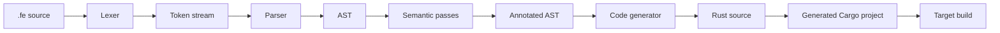

# Ferrum Architecture

This document is the maintainer reference for the current Ferrum codebase. It explains how the language is structured, how source code moves through the compiler, how the crates fit together, and why the major design choices exist.

The goal is not only to describe the intended shape of the system, but to reflect the implementation that exists today.

## Summary

Ferrum is an embedded DSL that compiles `.fe` source into Rust for bare-metal targets. The system is organized as a pipeline:

1. Lexer converts source text into spanned tokens.
2. Parser builds a typed AST and recovers from syntax errors.
3. Semantic analysis resolves symbols and enforces language rules in multiple passes.
4. Code generation emits Rust plus target-specific Cargo and linker configuration.
5. The generated Rust program depends on a runtime crate that is meant to wrap board-specific HAL details.

The main design principle is that hardware intent should be explicit and checkable before code is emitted. Ferrum pushes as many errors as possible to compile time, especially around hardware ownership, pin conflicts, and type correctness.

## Repository Layout

The workspace is split into three code-producing crates and supporting documentation:

- `compiler/` - the Ferrum front end and Rust emitter.
- `runtime/` - the intended board support and polling/scheduler bridge for generated code.
- `stdlib/` - the intended built-in function library for generated code.
- `spec/` - the language grammar and normative language specification.
- `examples/` - sample Ferrum source programs.

The `compiler` crate is the only active executable part of the toolchain today. The `runtime` crate already provides the core no_std support layer used by generated code, while `stdlib` remains the integration target that still needs fuller built-in function coverage.

## End-to-End Flow

The compiler follows a one-way pipeline. Each stage adds structure and rejects a different class of invalid input.

The important architectural property is that each stage has a narrow responsibility:

- Lexing handles characters, spans, and case normalization.
- Parsing handles grammar and tree shape.
- Semantic analysis handles meaning, scope, ownership, and hardware constraints.
- Code generation handles target selection and Rust emission only after the program is safe.

This separation makes the error model predictable. A syntax error should not masquerade as a type error, and a hardware ownership error should not require code generation to discover it.

## Compiler Crate

### `compiler/src/main.rs`

This is the CLI entry point and orchestrator.

It currently supports four modes:

- `ferrum <source.fe>` - full compile path.
- `ferrum check <source.fe>` - lex, parse, and semantic analysis only.
- `ferrum tokens <source.fe>` - dump lexer output for debugging.
- `ferrum ast <source.fe>` - dump the parsed AST for debugging.

The entry point is intentionally thin. It does not implement language logic itself; it delegates to the lexer, parser, semantic passes, diagnostics, and codegen modules. This keeps the executable layer small and makes the compiler easier to test in isolation.

### `compiler/src/lexer/`

The lexer is responsible for converting source text into spanned tokens.

Files:

- `token.rs` - token definitions, spans, identifiers, and keyword mapping.
- `lexer.rs` - character scanning and token emission.
- `mod.rs` - module surface and re-exports.

What it does:

- Skips whitespace and `--` comments.
- Tokenizes punctuation and operators.
- Recognizes integer, decimal, hex, clock-speed, and duration-like literals.
- Recognizes strings with escape handling.
- Emits spans for every token so later stages can report accurate locations.
- Normalizes keywords to a canonical form while preserving original identifier spelling.

Why this design exists:

- Ferrum keywords are case-insensitive, but identifiers must preserve source spelling for diagnostics and generated names.
- Keeping source locations in the lexer avoids reconstructing spans later and makes error reporting consistent across the pipeline.
- The lexer is non-fatal: it records `LexError` values and keeps scanning so the parser can still report more than one issue in a broken file.

The case-normalization policy is deliberate. Keywords are resolved through canonical token values, while identifiers store both a lowercase lookup key and the original text. This lets the compiler do case-insensitive name resolution without losing the user-facing spelling.

### `compiler/src/parser/`

The parser turns the token stream into an AST.

Files:

- `parser.rs` - recursive descent parser and error recovery.
- `mod.rs` - module wrapper.

What it does:

- Implements one method per grammar rule.
- Builds top-level sections in the locked order used by the language.
- Distinguishes between top-level `RUN` items and nested statement forms.
- Recovers after syntax errors by synchronizing to safe recovery points.

Why this design exists:

- Recursive descent matches the grammar shape directly, which makes the parser easier to audit against the EBNF.
- A hand-written parser is more convenient than a generated parser here because the language has many domain-specific constraints that are easier to express directly in code.
- Recovery is essential for a teaching-oriented language. The parser keeps going so users can fix several issues in one pass.

Important parser decisions:

- Top-level sections are parsed in a fixed sequence, which mirrors the language spec and simplifies semantic checks.
- `EVERY` placement is enforced structurally by the AST shape, not only by a later rule check.
- Loop-related statements such as `BREAK` and `CONTINUE` are tracked with parser state so invalid placement can be rejected early.

One implementation note matters for maintainers: error recovery should not rewind after a partially consumed production if that production may have already advanced the token stream. Rewinding in that case can create infinite error-recovery loops.

### `compiler/src/ast/`

The AST is the canonical in-memory representation of a parsed Ferrum program.

Files:

- `nodes.rs` - all node definitions.
- `mod.rs` - re-exports.

The AST carries the actual program structure:

- `Program` for the full file.
- Sections such as `ConfigSection`, `DefineItem`, `CreateItem`, `DeclareItem`, `FunctionDef`, and `RunSection`.
- Statement and expression nodes.
- Type, ownership, interface, and qualifier enums.

Why this design exists:

- The AST is the boundary between syntax and semantics. Once parsed, every later pass should be able to reason about the program without looking back at raw tokens.
- The node types are domain-specific instead of generic. That allows the compiler to represent hardware concepts directly rather than forcing them through an abstract language model.
- The AST is also the place where semantic passes annotate data, such as inferred expression types and function return types.

### `compiler/src/semantic/`

Semantic analysis is split into several passes rather than one monolithic walk.

Files:

- `mod.rs` - orchestrates the passes.
- `declaration_collector.rs` - registers symbols before body checking.
- `type_checker.rs` - validates types, ranges, and expression consistency.
- `ownership.rs` - enforces GIVE/LEND/BORROW rules and scheduled access rules.
- `device_checker.rs` - validates device-level hardware constraints.
- `symbol_table.rs` - scope-aware symbol resolution and ownership state.
- `diagnostic.rs` - typed diagnostics and severity model.

#### Semantic pass ordering

The analysis pipeline is intentionally staged:

1. Declaration collection.
2. Type checking.
3. Ownership checking.
4. Device checking.

This order is important because later passes depend on information established earlier:

- The symbol table must know every declared device, variable, constant, function, and device type before body analysis starts.
- Type checking needs symbol resolution to validate assignments, function calls, and expression types.
- Ownership checking depends on resolved devices and function parameters.
- Device checking depends on resolved device definitions and instances to catch pin conflicts and ambiguous writes.

The result is a `SemanticResult` that carries the annotated program and all diagnostics gathered across passes. If any error is present, the annotated program is withheld from code generation.

#### Declaration collector

The declaration collector registers top-level names before checking bodies.

Why it exists:

- Ferrum allows references to functions and devices that are declared elsewhere in the file.
- Pre-registration avoids order-dependent failures and supports more natural source organization.
- It also gives semantic passes a stable symbol table for cross references.

#### Symbol table

The symbol table is a stack of scopes keyed by lowercase identifier keys while preserving the original spelling for diagnostics.

It stores:

- Variables and constants.
- Device instances.
- Function signatures.
- Device type definitions.

Why this design exists:

- Lowercase keys make lookup case-insensitive while keeping source text intact.
- A scope stack is a straightforward fit for block scoping in `IF`, `LOOP`, `FOR`, `EVERY`, function bodies, and the top-level run section.
- Ownership state lives near the symbol entries so device availability can be checked consistently.

The table also supports diagnostic quality features such as duplicate-definition reporting, undefined-name suggestions, and ownership-aware resolution.

#### Diagnostic model

Diagnostics are structured rather than plain strings.

Each diagnostic records:

- Severity.
- A typed diagnostic kind.
- Source span.
- Human-readable message.
- Optional suggestion text.

Why this design exists:

- Structured diagnostics let the reporter format errors in a consistent way without losing semantic detail.
- Suggestions are part of the model, not an afterthought, because the language is intended to teach as it compiles.
- Keeping severity and typed kind separate allows future output formats, such as a terminal formatter, JSON output, or editor integration.

#### Type checker

The type checker validates type compatibility, literal ranges, return consistency, interface qualifiers, and inline conditional typing.

What it checks:

- CONFIG value types.
- DEFINE qualifier/interface compatibility.
- CREATE pin and INIT shape.
- DECLARE initialization and numeric ranges.
- FUNCTION body and return types.
- RUN section expression and statement typing.

Why this design exists:

- Ferrum uses types to encode real hardware constraints, not only programming convenience.
- Range checks such as `Percentage` and `Byte` prevent invalid values from reaching code generation.
- Inline `IF` expressions must be type-consistent so generated Rust remains well-typed without extra coercion logic.

The type checker also annotates the AST with inferred type information so codegen can stay simple.

#### Ownership checker

The ownership checker enforces the hardware ownership model.

It handles:

- Ownership keywords on device parameters.
- Matching ownership semantics at call sites.
- Ownership transfer for `GIVE`.
- Read-only restrictions for `LEND`.
- Scheduling conflicts between `EVERY` and `LOOP` when they write the same device.

Why this design exists:

- Hardware devices are exclusive resources. The ownership model gives that exclusivity a compile-time representation.
- Mapping ownership to Rust borrow semantics reduces the conceptual gap between Ferrum and generated Rust.
- Scheduled block conflict detection prevents two time domains from mutating the same device in a way that would be hard to reason about on bare metal.

#### Device checker

The device checker validates hardware-level shape constraints.

It handles:

- Duplicate pin assignments.
- Ambiguous `SET` targets.
- Interface coverage and init arity issues that depend on device shape.

Why this design exists:

- Pin conflicts are board-level errors, not type errors, so they belong in a hardware-aware semantic stage.
- A device may have multiple interfaces, so a write can be ambiguous without a qualifier. That ambiguity must be rejected before codegen.

## Code Generation Crate

### `compiler/src/codegen/`

Code generation converts an annotated Ferrum AST into a Rust project for the selected board.

Files:

- `mod.rs` - public entry point and emitted project metadata.
- `context.rs` - board profile selection and CONFIG interpretation.
- `name_mangler.rs` - name conversion helpers.
- `type_map.rs` - Ferrum type to Rust type mapping.
- `rust_emit.rs` - AST to Rust source emitter.

#### Board context

`EmitContext` is built from the parsed `CONFIG` section and is threaded through emission.

It selects:

- The target board profile.
- Debug mode.
- Serial settings.
- Optimization level.
- Debounce configuration.

Why this design exists:

- The emitter should not inspect raw config items repeatedly.
- A normalized context provides a single source of truth for all target-specific decisions.
- Adding a board should be a profile change, not a rewrite of the entire emitter.

#### Board profiles

Board profiles encode the target-specific knowledge needed by the emitter:

- HAL crate and version.
- Type expressions for pins and interfaces.
- Board initialization code.
- Pin access syntax.
- Delay expression syntax.
- Scheduler model choice.

Why this design exists:

- The code generator should stay board-agnostic.
- A profile-based design isolates micro:bit and RP2040 differences behind a small data structure.
- This makes it realistic to add future boards without changing every emitter branch.

#### Type mapping

`type_map.rs` maps Ferrum types to Rust types in context-sensitive positions.

Why this design exists:

- Local values, function parameters, returns, and struct fields do not all need the same Rust representation.
- Device parameters map naturally to owned values, shared references, or mutable references depending on ownership mode.
- Keeping this mapping isolated prevents Rust-specific details from leaking through the rest of the compiler.

#### Rust emitter

`rust_emit.rs` is the last transformation stage. It writes a complete Rust file with:

- `#![no_std]` and `#![no_main]`.
- HAL imports.
- Device struct definitions.
- Global declarations.
- Scheduling counters for `EVERY` blocks.
- User functions.
- The entry point and runtime setup.

Why this design exists:

- Ferrum compiles to embedded Rust, so the final artifact must be a standalone bare-metal Rust crate.
- Generating a full project rather than a fragment makes the output directly buildable.
- Keeping the emitter structured by output region helps maintainers see where a particular generated construct comes from.

The emitter currently uses a polling model for `EVERY` blocks. That choice is deliberate because it is simple, portable, and easy to reason about across boards without forcing interrupt setup into the first version of the language runtime.

## Runtime Crate

### `runtime/`

The runtime crate is the hardware abstraction layer bridge for generated Ferrum programs.

Current shape:

- `src/lib.rs` declares `#![no_std]` and re-exports the runtime traits and helpers.
- `src/traits.rs`, `src/scheduler.rs`, and `src/debounce.rs` provide the core runtime abstractions.
- `src/boards/microbit_v2.rs` and `src/boards/rp2040.rs` provide concrete board support.

Why this design exists:

- Generated Rust should depend on a small, controlled runtime surface rather than on raw HAL calls everywhere.
- Shared traits let the compiler emit one shape of program while the board profile chooses the concrete implementation.
- Keeping the runtime `no_std` matches the execution environment and avoids accidental host-only dependencies.

State today:

- The runtime crate is functional and forms part of the real generated-code contract.
- Some board-specific integration details may still evolve, but the crate itself is not a placeholder.

## Standard Library Crate

### `stdlib/`

The stdlib crate is intended to hold Ferrum built-in functions such as math helpers, conversions, collection helpers, and device utilities.

Why this design exists:

- Built-ins should have a stable Rust home so generated code can link against them consistently.
- Keeping built-ins separate from the compiler keeps the language front end smaller and the runtime contract clearer.

State today:

- The crate exists, but its implementation is currently a placeholder.
- Built-in functions still need to be implemented and aligned with what the language spec promises and what code generation expects.

## Specs and Examples

The `spec/` directory is part of the architecture, not just documentation.

Why it matters:

- The grammar file gives a formal reference for parser behavior.
- The language specification captures the contract that semantic analysis and code generation must preserve.
- Examples in `examples/` are the quickest way to verify that the implementation still matches the language model.

## Design Rationale

### Explicit hardware declarations

Ferrum requires devices and interfaces to be declared before use.

Reason:

- Embedded systems are resource constrained and hardware access is not abstract. Explicit declarations make pin assignment, ownership, and interface shape visible early.

### Case-insensitive keywords, case-preserving identifiers

Ferrum normalizes keywords but keeps the original identifier text.

Reason:

- Keywords should be forgiving for learners.
- Identifiers should preserve author intent and keep diagnostics readable.

### Multi-pass semantic analysis

Ferrum does not try to resolve everything in one walk.

Reason:

- Declarations must be known before bodies are checked.
- Ownership, type, and device rules depend on different facts.
- Separating passes makes error reporting more precise and makes each rule easier to maintain.

### Rust as the compilation target

Ferrum emits Rust rather than machine code directly.

Reason:

- Rust already provides strong safety guarantees, embedded ecosystems, and mature board support.
- Emitting Rust lets Ferrum reuse the Rust toolchain for final validation and linking.
- This lowers the amount of backend code Ferrum must own while the language is still evolving.

### Polling for scheduled behavior

`EVERY` blocks currently use a polling counter model.

Reason:

- Polling is simpler than interrupts.
- It is easier to port across boards.
- It is easier to explain in an educational language.

### Structured diagnostics

Ferrum uses typed diagnostics rather than string-only errors.

Reason:

- The compiler can present better messages and suggestions.
- Different front ends can reuse the same semantic information.
- Structured errors are easier to test than free-form strings alone.

## Current Boundaries And Gaps

The architecture is clear, but some layers are still incomplete:

- The runtime crate needs a real HAL bridge that matches the emitter’s expectations.
- The stdlib crate still needs built-in function implementations.
- The emitted Rust currently assumes the runtime and target crates will be available in the generated project.
- Editor integration, such as syntax highlighting and diagnostics in VS Code, is still a future layer.

These gaps are not design flaws. They are simply the next integration steps in the architecture.

## Maintainer Notes

- Keep lexer spans accurate; many diagnostics depend on them.
- Preserve the parser’s recovery behavior so one syntax error does not hide the rest of the file.
- Add new semantic rules as separate checks when possible, rather than growing one pass indefinitely.
- Put target-specific details into board profiles instead of branching through the emitter.
- Treat the generated Rust project as the integration contract between Ferrum and the Rust ecosystem.

## Short Reference

- Lexer: turns text into tokens and spans.
- Parser: turns tokens into AST and recovers from syntax errors.
- AST: shared structure used by all later stages.
- Semantic analysis: resolves names and enforces language and hardware rules.
- Code generation: emits Rust and target project files.
- Runtime: intended board support layer for generated code.
- Stdlib: intended built-in function layer for generated code.

## Source Pointers

- [compiler/src/main.rs](compiler/src/main.rs)
- [compiler/src/lexer/](compiler/src/lexer)
- [compiler/src/parser/](compiler/src/parser)
- [compiler/src/ast/](compiler/src/ast)
- [compiler/src/semantic/](compiler/src/semantic)
- [compiler/src/codegen/](compiler/src/codegen)
- [runtime/src/lib.rs](runtime/src/lib.rs)
- [stdlib/src/lib.rs](stdlib/src/lib.rs)
- [spec/](spec)
